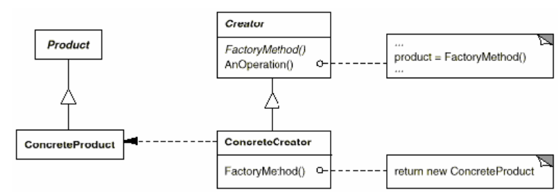
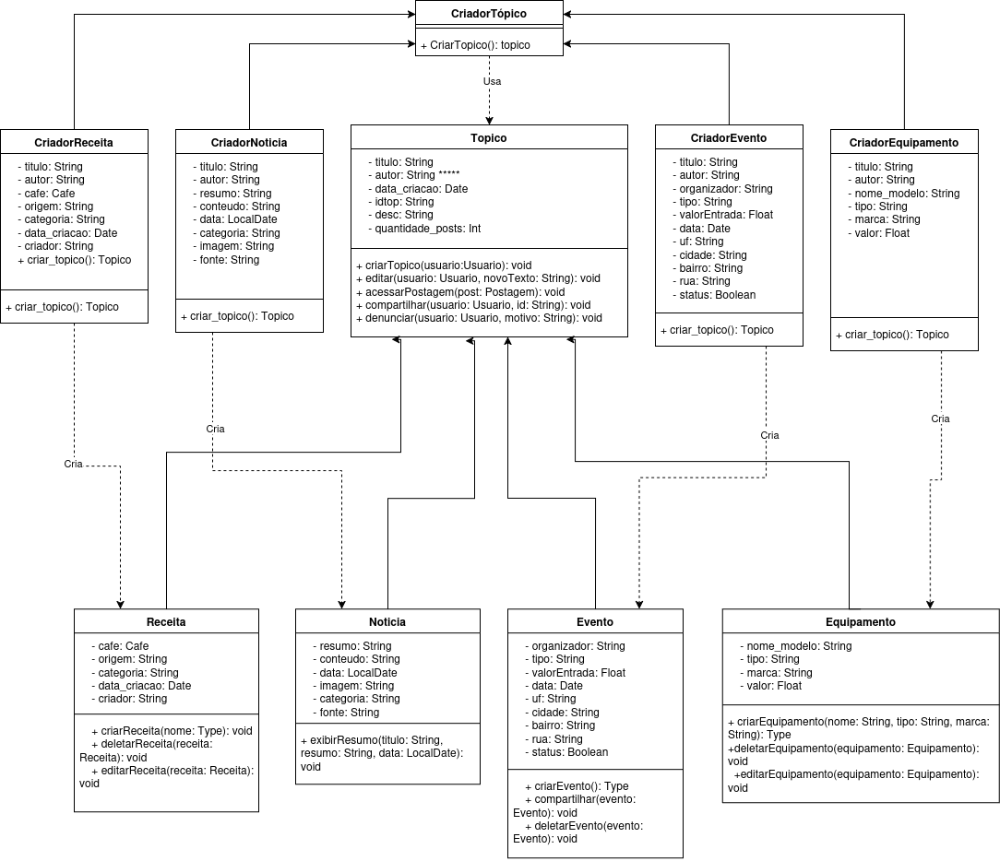
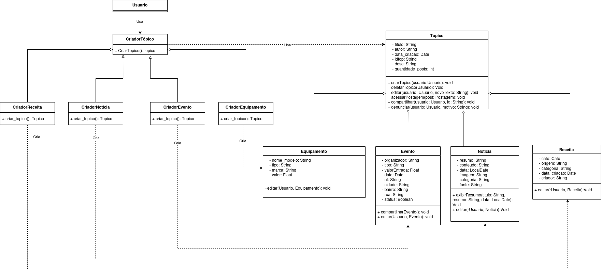

## Introdução

Os padrões de projeto criacionais, conforme definidos por Gamma et al.(1994)[¹](#referência-bibliográfica), têm como objetivo abstrair o processo de instanciação, promovendo a independência do sistema em relação à forma como seus objetos são criados, compostos e representados. Esses padrões tornam-se especialmente relevantes à medida que o sistema evolui, e a criação de objetos com comportamentos específicos passa a demandar mais do que a simples instanciação direta de classes. Há dois temas recorrentes nesses padrões:

-  Eles encapsulam conhecimento sobre quais classes concretas o sistema utiliza;
- Eles ocultam o como as instâncias dessas classes são criadas e combinadas.

Esses padrões proporcionam flexibilidade em decidir o quê é criado, por quem, como e quando permitindo a configuração de objetos 'produtos' que variem sua estrutura e funcionalidade conforme a necessidade da aplicação.

## Objetivo

Tomar vantagem dos padrões de projeto criacionais e seus benefícios, em especial o Factory method, para alcançar uma melhor qualidade de modelagem do sistema. 

## Metodogia

O diagrama de classes construído da fase anterior do projeto foi analisado de forma a se enxergar oportunidades de melhoria com a aplicação do factory method segundo a aplicabilidade definida por Gamma et al.(1994)[¹](#referência-bibliográfica):

- Quando a classe não consegue prever a classe de objetos a serem criados;
- quando a classe quer que suas subclasses especifiquem os objetos que criam;
- quando classes delegam responsabilidade para uma de diversas subclasses de apoio e se quer localizar o conhecimento de a qual subclasse se delegou.

A seção identificada como própria para aplicar o factory method foi a que compreende a classe Tópico e suas subclasses. Sem esse padrão, a criação de novos tipos de tópicos exige instanciar diretamente as classes concretas, o que aumenta o acoplamento do código e dificulta sua manutenção. Além de tornar mais complexa a adição de novos tipos de Topico e a evolução do código. A partir daí foi aplicado o factory method como estruturado por Gamma et al.(1994)[¹](#referência-bibliográfica) como mostra a figura 1.

<center>
<font size="3"><p style="text-align: center"><b>Figura 1:</b>  Estrutura do Factory Method </p></font>

<div style="text-align: center;">
    
</div>

<font size="3"><p style="text-align: center"><b>Autor:</b>  Gamma et al., 1994</p></font>
</center>

- **Product:** define a interface dos objetos criados pelos factory methods
- **ConcreteProduct:** implementa a interface de Produto
- **Creator:** declara o factory method que retorna um objeto do tipo Produto. Pode definir uma implementação default para o método, além de poder chamar o factory method.
- **ConcreteCreator:** sobrescreve o factory method para retornar uma instância de ContreteProduct

## Modelagem

<center>
<font size="3"><p style="text-align: center"><b>Figura 2:</b> Primeira versão do Diagrama de Classes do Padrão Factory Method</p></font>

<div style="text-align: center;">
    
</div>

<font size="3"><p style="text-align: center"><b>Autor:</b> <a href="https://github.com/PedroHhenriq">Pedro Henrique</a>, 2025</p></font>
</center>

- **Topico:** é o Product
- **Receita, Noticia, Evento, Equipamento:** são os ConcreteProducts
- **CriadorTopico:** é o Creator 
- **CriadorReceita, CriadorNoticia, CriadorEvento, CriadorEquipamento:** são os ConcreteCreators

Dessa forma conseguimos reduzir acoplamento entre classes e aumentar a coesão ao transportar a criação de produtos para um local concentrado. Por consequência, a manutenibilidade do código é aprimorada, bem como a evolução do sistema além de ser, pois é possível adicionar outros produtos sem prejudicar o código existente. Além disso, esse padrão permite melhor aproveitar de recursos do sistema ao reutilizar objetos já existentes.
Todas essas vantagens superam o ponto negativo de ter de adicionar novas subclasses para implementar esse padrão.

<center>
<font size="3"><p style="text-align: center"><b>Figura 3:</b> Segunda versão do Diagrama de Classes do Padrão Factory Method</p></font>

<div style="text-align: center;">
    
</div>

<font size="3"><p style="text-align: center"><b>Autor:</b> <a href="https://github.com/Joa0v">João</a>, 2025</p></font>
</center>

**Adição da Classe Usuario**
- **Antes:** Apenas estrutura hierárquica dos produtos e criadores
- **Depois:** Classe `Usuario` como cliente principal do sistema

**Centralização do Uso**
- **Antes:** Criadores utilizados diretamente no código
- **Depois:** Método `usar_criador()` centraliza o uso de qualquer factory

**Fortalecimento do Padrão**
- Cliente trabalha apenas com abstrações, delegando criação aos factories

## Implementação

```python
from abc import ABC, abstractmethod
from datetime import datetime

# Produto abstrato
class Topico(ABC):
    def __init__(self, idtop, titulo, autor, data_criacao, desc, quantidade_posts):
        self.idtop = idtop
        self.titulo = titulo
        self.autor = autor
        self.data_criacao = data_criacao
        self.desc = desc
        self.quantidade_posts = quantidade_posts
    
    @abstractmethod
    def criarTopico(self, usuario):
        pass
    
    @abstractmethod
    def deletarTopico(self, usuario):
        pass
    
    @abstractmethod
    def editar(self, usuario, novoTexto):
        pass
    
    @abstractmethod
    def acessarPostagem(self, post):
        pass
    
    @abstractmethod
    def compartilhar(self, usuario, id):
        pass
    
    @abstractmethod
    def denunciar(self, usuario, motivo):
        pass

# Produtos concretos
class Noticia(Topico):
    def __init__(self, idtop, titulo, autor, data_criacao, desc, quantidade_posts,
                 conteudo, data, imagem, categoria, fonte):
        super().__init__(idtop, titulo, autor, data_criacao, desc, quantidade_posts)
        self.conteudo = conteudo
        self.data = data
        self.imagem = imagem
        self.categoria = categoria
        self.fonte = fonte
    
    def criarTopico(self, usuario):
        print(f"Notícia '{self.titulo}' criada por {usuario}.")
    
    def deletarTopico(self, usuario):
        print(f"Notícia '{self.titulo}' deletada por {usuario}.")
    
    def editar(self, usuario, novoTexto):
        print(f"Notícia '{self.titulo}' editada por {usuario}. Novo texto: {novoTexto}")
    
    def acessarPostagem(self, post):
        print(f"Acessando postagem '{post}' da notícia '{self.titulo}'")
    
    def compartilhar(self, usuario, id):
        print(f"Usuário {usuario} compartilhou notícia '{self.titulo}' (ID: {id})")
    
    def denunciar(self, usuario, motivo):
        print(f"Usuário {usuario} denunciou notícia '{self.titulo}' por: {motivo}")
    
    def exibirResumo(self, titulo, resumo, data):
        print(f"Título: {titulo}")
        print(f"Resumo: {resumo}")
        print(f"Data: {data}")
    
    def editar(self, usuario, noticia):
        print(f"Notícia editada por {usuario}: {noticia}")

class Receita(Topico):
    def __init__(self, idtop, titulo, autor, data_criacao, desc, quantidade_posts,
                 cafe, origem, categoria, data_criacao_receita):
        super().__init__(idtop, titulo, autor, data_criacao, desc, quantidade_posts)
        self.cafe = cafe
        self.origem = origem
        self.categoria = categoria
        self.data_criacao_receita = data_criacao_receita
    
    def criarTopico(self, usuario):
        print(f"Receita '{self.titulo}' criada por {usuario}.")
    
    def deletarTopico(self, usuario):
        print(f"Receita '{self.titulo}' deletada por {usuario}.")
    
    def editar(self, usuario, novoTexto):
        print(f"Receita '{self.titulo}' editada por {usuario}. Novo texto: {novoTexto}")
    
    def acessarPostagem(self, post):
        print(f"Acessando postagem '{post}' da receita '{self.titulo}'")
    
    def compartilhar(self, usuario, id):
        print(f"Usuário {usuario} compartilhou receita '{self.titulo}' (ID: {id})")
    
    def denunciar(self, usuario, motivo):
        print(f"Usuário {usuario} denunciou receita '{self.titulo}' por: {motivo}")
    
    def editar(self, usuario, receita):
        print(f"Receita editada por {usuario}: {receita}")

class Evento(Topico):
    def __init__(self, idtop, titulo, autor, data_criacao, desc, quantidade_posts,
                 organizador, tipo, valorEntrada, data, uf, cidade, bairro, rua, status):
        super().__init__(idtop, titulo, autor, data_criacao, desc, quantidade_posts)
        self.organizador = organizador
        self.tipo = tipo
        self.valorEntrada = valorEntrada
        self.data = data
        self.uf = uf
        self.cidade = cidade
        self.bairro = bairro
        self.rua = rua
        self.status = status
    
    def criarTopico(self, usuario):
        print(f"Evento '{self.titulo}' criado por {usuario}.")
    
    def deletarTopico(self, usuario):
        print(f"Evento '{self.titulo}' deletado por {usuario}.")
    
    def editar(self, usuario, novoTexto):
        print(f"Evento '{self.titulo}' editado por {usuario}. Novo texto: {novoTexto}")
    
    def acessarPostagem(self, post):
        print(f"Acessando postagem '{post}' do evento '{self.titulo}'")
    
    def compartilhar(self, usuario, id):
        print(f"Usuário {usuario} compartilhou evento '{self.titulo}' (ID: {id})")
    
    def denunciar(self, usuario, motivo):
        print(f"Usuário {usuario} denunciou evento '{self.titulo}' por: {motivo}")
    
    def compartilharEvento(self):
        print(f"Evento '{self.titulo}' compartilhado.")
    
    def editar(self, usuario, evento):
        print(f"Evento editado por {usuario}: {evento}")

class Equipamento(Topico):
    def __init__(self, idtop, titulo, autor, data_criacao, desc, quantidade_posts,
                 nome_modelo, tipo, marca, valor):
        super().__init__(idtop, titulo, autor, data_criacao, desc, quantidade_posts)
        self.nome_modelo = nome_modelo
        self.tipo = tipo
        self.marca = marca
        self.valor = valor
    
    def criarTopico(self, usuario):
        print(f"Equipamento '{self.nome_modelo}' criado por {usuario}.")
    
    def deletarTopico(self, usuario):
        print(f"Equipamento '{self.nome_modelo}' deletado por {usuario}.")
    
    def editar(self, usuario, novoTexto):
        print(f"Equipamento '{self.nome_modelo}' editado por {usuario}. Novo texto: {novoTexto}")
    
    def acessarPostagem(self, post):
        print(f"Acessando postagem '{post}' do equipamento '{self.nome_modelo}'")
    
    def compartilhar(self, usuario, id):
        print(f"Usuário {usuario} compartilhou equipamento '{self.nome_modelo}' (ID: {id})")
    
    def denunciar(self, usuario, motivo):
        print(f"Usuário {usuario} denunciou equipamento '{self.nome_modelo}' por: {motivo}")
    
    def editar(self, usuario, equipamento):
        print(f"Equipamento editado por {usuario}: {equipamento}")

# Criador abstrato (Factory)
class CriadorTopico(ABC):
    @abstractmethod
    def criar_topico(self):
        pass

# Criadores concretos (Concrete Factories)
class CriadorNoticia(CriadorTopico):
    def __init__(self, idtop, titulo, autor, data_criacao, desc, quantidade_posts,
                 conteudo, data, imagem, categoria, fonte):
        self.idtop = idtop
        self.titulo = titulo
        self.autor = autor
        self.data_criacao = data_criacao
        self.desc = desc
        self.quantidade_posts = quantidade_posts
        self.conteudo = conteudo
        self.data = data
        self.imagem = imagem
        self.categoria = categoria
        self.fonte = fonte
    
    def criar_topico(self) -> Noticia:
        return Noticia(
            self.idtop, self.titulo, self.autor, self.data_criacao, self.desc, self.quantidade_posts,
            self.conteudo, self.data, self.imagem, self.categoria, self.fonte
        )

class CriadorReceita(CriadorTopico):
    def __init__(self, idtop, titulo, autor, data_criacao, desc, quantidade_posts,
                 cafe, origem, categoria, data_criacao_receita):
        self.idtop = idtop
        self.titulo = titulo
        self.autor = autor
        self.data_criacao = data_criacao
        self.desc = desc
        self.quantidade_posts = quantidade_posts
        self.cafe = cafe
        self.origem = origem
        self.categoria = categoria
        self.data_criacao_receita = data_criacao_receita
    
    def criar_topico(self) -> Receita:
        return Receita(
            self.idtop, self.titulo, self.autor, self.data_criacao, self.desc, self.quantidade_posts,
            self.cafe, self.origem, self.categoria, self.data_criacao_receita
        )

class CriadorEvento(CriadorTopico):
    def __init__(self, idtop, titulo, autor, data_criacao, desc, quantidade_posts,
                 organizador, tipo, valorEntrada, data, uf, cidade, bairro, rua, status):
        self.idtop = idtop
        self.titulo = titulo
        self.autor = autor
        self.data_criacao = data_criacao
        self.desc = desc
        self.quantidade_posts = quantidade_posts
        self.organizador = organizador
        self.tipo = tipo
        self.valorEntrada = valorEntrada
        self.data = data
        self.uf = uf
        self.cidade = cidade
        self.bairro = bairro
        self.rua = rua
        self.status = status
    
    def criar_topico(self) -> Evento:
        return Evento(
            self.idtop, self.titulo, self.autor, self.data_criacao, self.desc, self.quantidade_posts,
            self.organizador, self.tipo, self.valorEntrada, self.data, self.uf, self.cidade,
            self.bairro, self.rua, self.status
        )

class CriadorEquipamento(CriadorTopico):
    def __init__(self, idtop, titulo, autor, data_criacao, desc, quantidade_posts,
                 nome_modelo, tipo, marca, valor):
        self.idtop = idtop
        self.titulo = titulo
        self.autor = autor
        self.data_criacao = data_criacao
        self.desc = desc
        self.quantidade_posts = quantidade_posts
        self.nome_modelo = nome_modelo
        self.tipo = tipo
        self.marca = marca
        self.valor = valor
    
    def criar_topico(self) -> Equipamento:
        return Equipamento(
            self.idtop, self.titulo, self.autor, self.data_criacao, self.desc, self.quantidade_posts,
            self.nome_modelo, self.tipo, self.marca, self.valor
        )

class Usuario:
    def __init__(self, nome):
        self.nome = nome
    
    def usar_criador(self, criador: CriadorTopico):
        """Método para usar qualquer criador de tópico"""
        topico = criador.criar_topico()
        topico.criarTopico(self.nome)
        return topico
```
<center>
<font size="3"><p style="text-align: center"><b>Autor:</b> <a href="https://github.com/DiegoCarlito">Diego Carlito</a> e <a href="https://github.com/PedroHhenriq">Pedro Henrique</a>, 2025</p></font>
</center>

## Conclusão

O uso do padrão Factory Method foi uma escolha estratégica para o sistema de tópicos, pois permitiu delegar a criação de diferentes tipos de conteúdo (Notícias, Receitas, Eventos e Equipamentos), promovendo flexibilidade e desacoplamento no código. A implementação do Factory Method mostrou-se ideal para o contexto de uma única família de produtos - os tópicos - proporcionando vantagens como modularização, reutilização de código e eliminação de redundâncias.

A introdução da classe `Usuario` como cliente principal fortaleceu ainda mais o padrão, centralizando o uso dos criadores através do método `usar_criador()` e garantindo que o cliente trabalhe exclusivamente com abstrações. Isso possibilitou a fácil expansão do sistema com novos tipos de tópicos, mantendo o código modular e objetivo.

Além disso, a arquitetura resultante garante que futuras modificações, como a inclusão de novos tipos de tópicos ou funcionalidades específicas, possam ser implementadas de forma eficiente, sem a necessidade de grandes alterações no código existente. O padrão demonstrou na prática como resolver problemas reais de acoplamento e extensibilidade em sistemas orientados a objetos.

## Referência Bibliográfica

> 1. GAMMA, E. *et al.* Design Patterns. [s.l.] Pearson Education, 1994.

## Bibliografia

> REFACTORING GURU. Design Patterns: Factory Method. Disponível em: https://refactoring.guru/design-patterns/factory-method. Acesso em: 26 maio. 2024.

## Histórico de Versão

| Versão | Data       | Alteração              | Responsável     | Revisor           | Data de revisão |
|--------|------------|------------------------|------------------|-------------------|------------------|
| `1.0` | 01/06/2025  | Versão inicial do artefato. | [João](https://github.com/Joa0V) | [Diego Carlito](https://github.com/DiegoCarlito) | 02/06/2025 |
| `1.1` | 02/06/2025  | Adiciona diagramas UML do padrão Factory Method. | [Diego Carlito](https://github.com/DiegoCarlito) |  |  |
| `1.2` | 02/06/2025  | Adiciona código da implementação. | [Diego Carlito](https://github.com/DiegoCarlito) e [Pedro Henrique](https://github.com/PedroHhenriq) |  |  |
| `1.3` | 02/06/2025  | Adiciona conclusão. | [Diego Carlito](https://github.com/DiegoCarlito) | [João](https://github.com/Joa0V) | 02/06/2025 |
