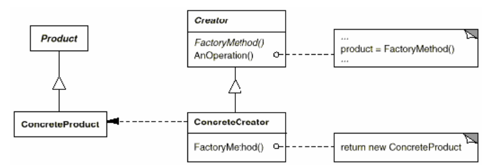

## Introdução

Os padrões de projeto criacionais, conforme definidos por Gamma et al.(1994)[¹](#referência-bibliográfica), têm como objetivo abstrair o processo de instanciação, promovendo a independência do sistema em relação à forma como seus objetos são criados, compostos e representados. Esses padrões tornam-se especialmente relevantes à medida que o sistema evolui, e a criação de objetos com comportamentos específicos passa a demandar mais do que a simples instanciação direta de classes. Há dois temas recorrentes nesses padrões:

-  Eles encapsulam conhecimento sobre quais classes concretas o sistema utiliza;
- Eles ocultam o como as instâncias dessas classes são criadas e combinadas.

Esses padrões proporcionam flexibilidade em decidir o quê é criado, por quem, como e quando permitindo a configuração de objetos 'produtos' que variem sua estrutura e funcionalidade conforme a necessidade da aplicação.

## Objetivo

Tomar vantagem dos padrões de projeto criacionais e seus benefícios, em especial o Factory method, para alcançar uma melhor qualidade de modelagem do sistema. 

## Metodogia

O diagrama de classes construído da fase anterior do projeto foi analisado de forma a se enxergar oportunidades de melhoria com a aplicação do factory method segundo a aplicabilidade definida por Gamma et al.(1994)[¹](#referência-bibliográfica):

- Quando a classe não consegue prever a classe de objetos a serem criados;
- quando a classe quer que suas subclasses especifiquem os objetos que criam;
- quando classes delegam responsabilidade para uma de diversas subclasses de apoio e se quer localizar o conhecimento de a qual subclasse se delegou.

A seção identificada como própria para aplicar o factory method foi a que compreende a classe Tópico e suas subclasses. A partir daí foi aplicado o factory method como estruturado por Gamma et al.(1994)[¹](#referência-bibliográfica) como mostra a figura 1.

<center>
<font size="3"><p style="text-align: center"><b>Figura 1:</b>  Estrutura do Factory Method </p></font>

<div style="text-align: center;">
    
</div>

<font size="3"><p style="text-align: center"><b>Autor:</b>  Gamma et al., 1994</p></font>
</center>

- **Product:** define a interface dos objetos criados pelos factory methods
- **ConcreteProduct:** implementa a interface de Produto
- **Creator:** declara o factory method que retorna um objeto do tipo Produto. Pode definir uma implementação default para o método, além de poder chamar o factory method.
- **ConcreteCreator:** sobrescreve o factory method para retornar uma instância de ContreteProduct

## Modelagem

```
PLACE HOLDER: FACTORY METHOD APLICATION DIAGRAM
```

- **Topico:** é o Product
- **Receita, Noticia, Evento, Equipamento:** são os ConcreteProducts
- **CriadorTopico:** é o Creator 
- **CriadorReceita, CriadorNoticia, CriadorEvento, CriadorEquipamento:** são os ConcreteCreators

Dessa forma conseguimos reduzir acoplamento entre classes e aumentar a coesão ao transportar a criação de produtos para um local concentrado. Por consequência, a manutenibilidade do código é aprimorada, bem como a evolução do sistema além de ser, pois é possível adicionar outros produtos sem prejudicar o código existente. Além disso, esse padrão permite melhor aproveitar de recursos do sistema ao reutilizar objetos já existentes.
Todas essas vantagens superam o ponto negativo de ter de adicionar novas subclasses para implementar esse padrão. 

## Implementação

## Referência Bibliográfica

> 1. GAMMA, E. *et al.* Design Patterns. [s.l.] Pearson Education, 1994.

## Bibliografia

> REFACTORING GURU. Design Patterns: Factory Method. Disponível em: https://refactoring.guru/design-patterns/factory-method. Acesso em: 26 maio. 2024.

## Histórico de Versão

| Versão | Data | Descrição | Autor(es) | Revisor(es) |
| :-: | :-: | :-: | :-: | :-: |
| `1.0` | 01/06/2025  | Versão inicial do artefato. | [João](https://github.com/Joa0V) | - |

