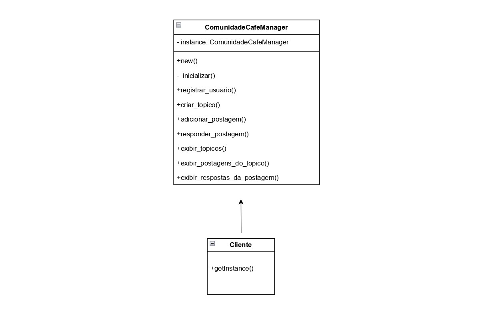
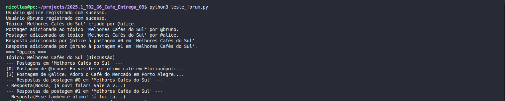

# Singleton

## Introdução

O padrão de projeto **Singleton** é amplamente utilizado em sistemas orientados a objetos quando se deseja garantir que apenas uma instância de uma determinada classe seja criada durante a execução do programa. Isso é útil, por exemplo, quando há necessidade de um ponto central de controle ou gerenciamento de recursos compartilhados.

Neste projeto, implementamos o padrão Singleton na classe `ComunidadeCafeManager`, responsável por centralizar todas as ações relacionadas à comunidade do sistema **Café e Cia** — como registro de usuários, criação de tópicos, adição de postagens e respostas, além da exibição de conteúdos. Utilizando o Singleton, garantimos que todas essas operações sejam coordenadas de maneira unificada, evitando inconsistências e conflitos em ambientes multi-threaded.

A classe `Cliente` atua como ponto de acesso para obter a instância única do `ComunidadeCafeManager`, reforçando a ideia de controle centralizado do comportamento da aplicação.

---

## Metodologia

Para implementar o padrão Singleton no sistema **Café e Cia**, seguimos uma abordagem orientada a objetos, aplicando os seguintes princípios e estratégias:

- **Unicidade**: Foi garantido que a classe `ComunidadeCafeManager` só possa ser instanciada uma única vez por meio de atributos privados e um método de acesso controlado.
  
- **Encapsulamento de funcionalidades**: Centralizamos todas as operações da comunidade (registro de usuário, criação de tópicos, adição de postagens e respostas) dentro da classe Singleton.

- **Controle de acesso**: O método `getInstance()` da classe `Cliente` permite acessar a única instância existente de `ComunidadeCafeManager`, seguindo o padrão Singleton clássico.

- **Organização e legibilidade**: O diagrama foi utilizado como guia para a estruturação das classes, tornando o código mais modular, escalável e fácil de manter.

As decisões de projeto foram tomadas após discussões em grupo, com foco em tornar o sistema robusto e capaz de gerenciar múltiplas interações de maneira segura e eficiente.

---

## Modelagem

A modelagem do sistema contempla duas classes principais:

- **`ComunidadeCafeManager`**: Classe Singleton que centraliza todas as ações da comunidade. Nela estão definidos os métodos:
  - `registrar_usuario()`
  - `criar_topico()`
  - `adicionar_postagem()`
  - `responder_postagem()`
  - `exibir_topicos()`
  - `exibir_postagens_do_topico()`
  - `exibir_respostas_da_postagem()`

  Essa classe possui um atributo privado `instance` que armazena sua única instância e métodos de controle de inicialização e acesso.

- **`Cliente`**: Classe auxiliar que utiliza o método `getInstance()` para obter a instância única de `ComunidadeCafeManager` e realizar as operações da comunidade.

<center>
<p style="text-align: center"><b>Figura 1:</b> Diagrama UML para o Singleton utilizado no projeto.</p>



<font size="3"><p style="text-align: center"><b>Autor:</b> <a href="">Samuel Ribeiro, Nicollas Gabriel, Guilherme Coelho, Gustavo Alves de Souza. </a>, 2025</p></font>
</center>
## Estrutura


# Sistema de Comunidade de Café - Explicação do Código

Este projeto simula uma comunidade de café onde usuários podem criar tópicos, postar mensagens e interagir por meio de curtidas e denúncias.

---

##  Classe `Usuario`

```python
class Usuario:
    def __init__(self, nome, nome_usuario, senha, permissoes):
        self.nome = nome
        self.nome_usuario = nome_usuario
        self.senha = senha
        self.permissoes = permissoes
        self.topicos_seguidos = set()
        self.usuarios_seguidos = set()
```

- Representa um usuário da comunidade.
- `topicos_seguidos` e `usuarios_seguidos` são conjuntos (`set`) para evitar duplicidade.

### Métodos

```python
def seguir_topico(self, topico):
    self.topicos_seguidos.add(topico)

def seguir_usuario(self, outro_usuario):
    self.usuarios_seguidos.add(outro_usuario)

def curtir_resposta(self, resposta):
    resposta.curtir()

def denunciar_resposta(self, resposta):
    resposta.denunciar()

def __str__(self):
    return f'@{self.nome_usuario}'
```

---

##  Classe `Resposta`

```python
class Resposta:
    def __init__(self, conteudo, autor):
        self.conteudo = conteudo
        self.autor = autor
        self.quantidade_likes = 0
```

- Representa uma resposta feita a uma postagem.

### Métodos

```python
def curtir(self):
    self.quantidade_likes += 1

def denunciar(self):
    print(f"Resposta de {self.autor} denunciada.")

def __str__(self):
    return f'Resposta({self.conteudo[:30]}...)'
```

---

## Classe `Postagem`

```python
class Postagem:
    def __init__(self, autor, texto):
        self.autor = autor
        self.texto = texto
        self.respostas = []
```

- Representa uma postagem dentro de um tópico.

### Métodos

```python
def adicionar_resposta(self, resposta):
    self.respostas.append(resposta)

def editar_postagem(self, novo_texto):
    self.texto = novo_texto

def __str__(self):
    return f'Postagem de {self.autor}: {self.texto[:40]}...'
```

---

##  Classe `Topico`

```python
class Topico:
    def __init__(self, titulo, autor, tipo, descricao):
        self.titulo = titulo
        self.autor = autor
        self.tipo = tipo
        self.descricao = descricao
        self.postagens = []
```

- Cada tópico é criado por um usuário e pode conter várias postagens.

### Métodos

```python
def adicionar_postagem(self, postagem):
    self.postagens.append(postagem)

def __str__(self):
    return f'Tópico: {self.titulo} ({self.tipo})'
```

---

##  Classe `ComunidadeCafeManager` (Singleton)

```python
class ComunidadeCafeManager:
    _instancia = None

    def __new__(cls):
        if cls._instancia is None:
            cls._instancia = super(ComunidadeCafeManager, cls).__new__(cls)
            cls._instancia._inicializar()
        return cls._instancia
```

- Utiliza o padrão **Singleton**: garante apenas uma instância da classe.

### Inicialização

```python
def _inicializar(self):
    self.usuarios = {}
    self.topicos = []
```

---

##  Funcionalidades

### Registrar Usuário

```python
def registrar_usuario(self, nome, nome_usuario, senha, permissoes="padrão"):
    ...
```

- Adiciona novo usuário, se o nome de usuário não existir.

### Criar Tópico

```python
def criar_topico(self, titulo, nome_usuario, tipo, descricao):
    ...
```

- Permite a criação de novos tópicos por usuários cadastrados.

### Adicionar Postagem

```python
def adicionar_postagem(self, titulo_topico, nome_usuario, texto):
    ...
```

- Posta uma nova mensagem em um tópico existente.

### Responder Postagem

```python
def responder_postagem(self, titulo_topico, index_postagem, nome_usuario, conteudo_resposta):
    ...
```

- Responde a uma postagem específica.

### Exibir Dados

```python
def exibir_topicos(self):
    ...

def exibir_postagens_do_topico(self, titulo_topico):
    ...

def exibir_respostas_da_postagem(self, titulo_topico, index_postagem):
    ...
```

- Métodos para visualizar o conteúdo da comunidade.

---

## Teste de logs

<center>
<p style="text-align: center"><b>Figura 2:</b> Logs do Singleton.</p>



<font size="3"><p style="text-align: center"><b>Autor:</b> <a href="">Samuel Ribeiro, Nicollas Gabriel, Guilherme Coelho, Gustavo Alves de Souza. </a>, 2025</p></font>
</center>

---

##  Conclusão

Este sistema orientado a objetos modela uma comunidade digital com foco em café, com funcionalidades típicas de fóruns:
- Registro e autenticação de usuários,
- Criação de tópicos e postagens,
- Respostas com curtidas e denúncias,
- Acompanhamento de conteúdo por parte dos usuários.

## Estrutura


Esse modelo garante uma estrutura sólida, segura e com alto grau de reutilização de código, ao mesmo tempo em que assegura o controle sincronizado sobre os dados da comunidade.

### Bibliografia

TUTORIALSPOINT. Singleton Pattern. Disponível em: <https://www.tutorialspoint.com/design_pattern/singleton_pattern.htm>. Acesso em: 30 maio 2025.

GEEKSFORGEEKS. Singleton Pattern in Python – A Complete Guide. Disponível em: <https://www.geeksforgeeks.org/singleton-pattern-in-python-a-complete-guide/>. Acesso em: 30 maio 2025.

REFACTORING GURU. Padrão Singleton. Disponível em: <https://refactoring.guru/pt-br/design-patterns/singleton>. Acesso em: 30 maio 2025.


### Histórico de Versão

| Versão | Data       | Alteração              | Responsável     | Revisor           | Data de revisão |
|--------|------------|------------------------|------------------|-------------------|------------------|
| `1.0` | 30/05/2025  | Criação do documento e conteúdo. | [Samuel Ribeiro](https://github.com/SamuelRicosta), [Gustavo Alves](https://github.com/gustaallves), [Guilherme Coelho](https://github.com/Guilermanoo), [Nicollas Gabriel](https://github.com/Nicollaxs) ||  |