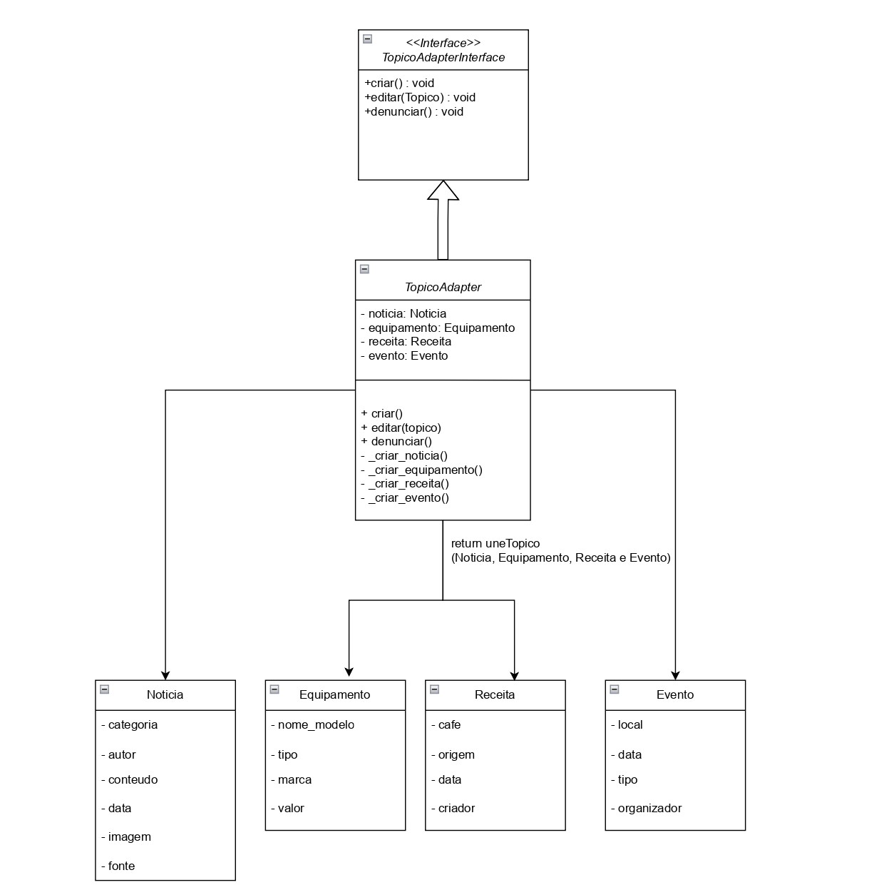
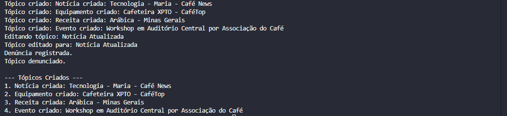

# Adapter

## Introdução

O padrão de projeto *Adapter* é utilizado para permitir que classes com interfaces incompatíveis possam trabalhar juntas, agindo como um tradutor entre elas. Ele funciona como um intermediário que adapta a interface de uma classe existente para outra interface esperada pelo sistema, sem alterar o código original dessas classes.

Usamos o Adapter para promover o desacoplamento entre componentes, facilitando a integração de sistemas distintos, a reutilização de código e a manutenção do software. Esse padrão é especialmente útil quando precisamos adaptar diferentes implementações ou integrar novos módulos sem modificar a estrutura existente, garantindo maior flexibilidade e escalabilidade no desenvolvimento.

Aplicamos esse padrão para unificar as operações das entidades derivadas de Tópico — Notícia, Equipamento, Receita e Evento — por meio de um único Adapter unificado. Essa solução permite tratar essas diversas entidades de forma consistente e desacoplada, facilitando a manutenção, extensibilidade e evolução do sistema. A implementação foi realizada em Python, explorando classes abstratas para definir contratos e uma classe Adapter concreta para orquestrar as operações específicas de cada entidade.

## Metodologia

O desenvolvimento do Adapter iniciou-se com a análise detalhada das entidades derivadas de Tópico, identificando suas semelhanças e particularidades. Definimos uma interface abstrata que estabelece os métodos essenciais (criar, editar e denunciar) a serem implementados pelo Adapter. Em seguida, desenvolvemos a classe Adapter unificada que recebe instâncias específicas de Notícia, Equipamento, Receita ou Evento e delega as chamadas para os métodos adequados a cada tipo. Para validar a implementação, foram elaborados testes unitários que garantem o correto funcionamento das operações para todas as entidades suportadas. Essa abordagem estruturada garantiu um design modular, que promove o reuso e a flexibilidade necessárias para futuras expansões do sistema.

## Modelagem

A modelagem do projeto reflete uma abordagem orientada a objetos que valoriza a reutilização e a flexibilidade do sistema. Ao centralizar as operações comuns das entidades derivadas de *Tópico* em um Adapter unificado, conseguimos abstrair as particularidades de cada entidade, promovendo uma arquitetura limpa e de fácil manutenção.

Essa centralização permite que novas entidades com características similares possam ser integradas ao sistema com mínimo esforço, bastando estender o Adapter para contemplar suas especificidades. Além disso, o uso de interfaces abstratas fortalece a garantia de que todas as implementações respeitam um conjunto consistente de operações, reduzindo o risco de erros e facilitando o desenvolvimento colaborativo.

Outro aspecto importante da modelagem é o isolamento da lógica de negócio das preocupações relacionadas à persistência e manipulação dos dados, que são tratadas exclusivamente pelos adapters. Isso cria uma camada de abstração que protege o domínio das mudanças tecnológicas, tornando o sistema mais resiliente a futuras evoluções.

Em resumo, essa estrutura garante um equilíbrio eficiente entre coesão e baixo acoplamento, fundamentais para a escalabilidade e sustentabilidade do sistema a longo prazo.

A seguir na Figura 1, apresentamos o diagrama que ilustra a estrutura do Adapter implementado no projeto.

<center>
<p style="text-align: center"><b>Figura 1:</b> Diagrama UML para o Adapter utilizado no projeto.</p>



<font size="3"><p style="text-align: center"><b>Autor:</b> <a href="">Samuel Ribeiro, Guilherme Coelho. </a>, 2025</p></font>
</center>

## Código

O código do Adapter encontra-se nos arquivos `adapter.py` e `teste_adapter.py`.

Abaixo, estão imagens e trechos da implementação, separados por tópicos e com títulos explicativos.

---

### Definição das Entidades de Tópico (`adapter.py`)

```python
# Classes que representam os diferentes tipos de tópicos do sistema

class Noticia:
    def __init__(self, categoria, autor, conteudo, data, imagem, fonte):
        self.categoria = categoria
        self.autor = autor
        self.conteudo = conteudo
        self.data = data
        self.imagem = imagem
        self.fonte = fonte

class Equipamento:
    def __init__(self, nome_modelo, tipo, marca, valor):
        self.nome_modelo = nome_modelo
        self.tipo = tipo
        self.marca = marca
        self.valor = valor

class Receita:
    def __init__(self, cafe, origem, data, criador):
        self.cafe = cafe
        self.origem = origem
        self.data = data
        self.criador = criador

class Evento:
    def __init__(self, local, data, tipo, organizador):
        self.local = local
        self.data = data
        self.tipo = tipo
        self.organizador = organizador
```
<font size="3"><p style="text-align: center"><b>Autor:</b> <a href="">Samuel Ribeiro, Guilherme Coelho. </a>, 2025</p></font>
</center>
---

### Interface do Adapter (`adapter.py`)

```python
# Interface que define as operações do Adapter

from abc import ABC, abstractmethod

class TopicoAdapterInterface(ABC):
    @abstractmethod
    def criar(self):
        pass

    @abstractmethod
    def editar(self, topico):
        pass

    @abstractmethod
    def denunciar(self):
        pass
```
<font size="3"><p style="text-align: center"><b>Autor:</b> <a href="">Samuel Ribeiro, Guilherme Coelho. </a>, 2025</p></font>
</center>
---

### Implementação do Adapter Unificado (`adapter.py`)

```python
# Adapter que permite tratar diferentes tipos de tópicos de forma uniforme

class TopicoAdapter(TopicoAdapterInterface):
    def __init__(self, noticia=None, equipamento=None, receita=None, evento=None):
        self.noticia = noticia
        self.equipamento = equipamento
        self.receita = receita
        self.evento = evento

    def criar(self):
        if self.noticia:
            return self._criar_noticia()
        elif self.equipamento:
            return self._criar_equipamento()
        elif self.receita:
            return self._criar_receita()
        elif self.evento:
            return self._criar_evento()
        else:
            raise ValueError("Nenhum tópico fornecido para criação.")

    def editar(self, topico):
        print(f"Editando tópico: {topico}")

    def denunciar(self):
        print("Denúncia registrada.")

    def _criar_noticia(self):
        return f"Notícia criada: {self.noticia.categoria} - {self.noticia.autor} - {self.noticia.fonte}"

    def _criar_equipamento(self):
        return f"Equipamento criado: {self.equipamento.nome_modelo} - {self.equipamento.marca}"

    def _criar_receita(self):
        return f"Receita criada: {self.receita.cafe} - {self.receita.origem}"

    def _criar_evento(self):
        return f"Evento criado: {self.evento.tipo} em {self.evento.local} por {self.evento.organizador}"
```
<font size="3"><p style="text-align: center"><b>Autor:</b> <a href="">Samuel Ribeiro, Guilherme Coelho. </a>, 2025</p></font>
</center>
---

### Gerenciador e Teste de Integração do Adapter (`teste_adapter.py`)

```python
# Gerenciador que utiliza o Adapter para criar, editar, denunciar e exibir tópicos

from adapter import Noticia, Equipamento, Receita, Evento, TopicoAdapter

class TopicoManager:
    def __init__(self):
        self.topicos = []

    def criar_topico(self, adapter):
        topico = adapter.criar()
        self.topicos.append(topico)
        print(f"Tópico criado: {topico}")

    def editar_topico(self, adapter, novo_nome):
        adapter.editar(novo_nome)
        print(f"Tópico editado para: {novo_nome}")

    def denunciar_topico(self, adapter):
        adapter.denunciar()
        print("Tópico denunciado.")

    def exibir_topicos(self):
        print("\n--- Tópicos Criados ---")
        for idx, topico in enumerate(self.topicos):
            print(f"{idx+1}. {topico}")

if __name__ == "__main__":
    manager = TopicoManager()

    noticia = Noticia(
        categoria="Tecnologia",
        autor="Maria",
        conteudo="Novo método de preparo de café.",
        data="2025-05-31",
        imagem="noticia1.png",
        fonte="Café News"
    )
    equipamento = Equipamento(
        nome_modelo="Cafeteira XPTO",
        tipo="Cafeteira",
        marca="CaféTop",
        valor=499.90
    )
    receita = Receita(
        cafe="Arábica",
        origem="Minas Gerais",
        data="2025-05-30",
        criador="João"
    )
    evento = Evento(
        local="Auditório Central",
        data="2025-06-10",
        tipo="Workshop",
        organizador="Associação do Café"
    )

    # Criando tópicos
    adapter_noticia = TopicoAdapter(noticia=noticia)
    manager.criar_topico(adapter_noticia)

    adapter_equipamento = TopicoAdapter(equipamento=equipamento)
    manager.criar_topico(adapter_equipamento)

    adapter_receita = TopicoAdapter(receita=receita)
    manager.criar_topico(adapter_receita)

    adapter_evento = TopicoAdapter(evento=evento)
    manager.criar_topico(adapter_evento)

    # Editando e denunciando tópicos
    manager.editar_topico(adapter_noticia, "Notícia Atualizada")
    manager.denunciar_topico(adapter_evento)

    # Exibindo todos os tópicos criados
    manager.exibir_topicos()
```
<font size="3"><p style="text-align: center"><b>Autor:</b> <a href="">Samuel Ribeiro, Guilherme Coelho. </a>, 2025</p></font>
</center>
---

## Validação

O objetivo do teste é validar a implementação do padrão Adapter na classe `TopicoAdapter`. Esse padrão permite que diferentes tipos de tópicos (Notícia, Equipamento, Receita e Evento) sejam tratados de maneira uniforme, sem depender diretamente das implementações específicas de cada classe.

O teste principal verifica a integração entre o Adapter e os diferentes tipos de tópicos. Ao criar, editar e denunciar tópicos usando o Adapter, os seguintes cenários são validados:

- Criação de tópicos de diferentes tipos, com exibição de informações relevantes.
- Edição e denúncia de tópicos de forma uniforme.
- Exibição de todos os tópicos criados.

Esses testes garantem que o `TopicoAdapter` atua como um mediador eficaz, abstraindo as diferenças entre os tipos de tópicos e permitindo que o sistema interaja de forma coesa com diferentes entidades do domínio.

---

## Saída 

Ao rodar o teste, a saída observada no terminal é:

<center>
<p style="text-align: center"><b>Figura 2:</b> Test Adapter.</p>



<font size="3"><p style="text-align: center"><b>Autor:</b> <a href="">Samuel Ribeiro, Guilherme Coelho. </a>, 2025</p></font>
</center>

## Conclusão

A implementação do padrão Adapter no projeto demonstrou ser uma solução eficiente para promover o desacoplamento e a flexibilidade entre diferentes entidades do domínio, como Notícia, Equipamento, Receita e Evento. Por meio de uma interface abstrata e de um Adapter unificado, foi possível centralizar e padronizar operações essenciais, facilitando a manutenção e a evolução do sistema.

Os testes realizados comprovaram que o Adapter permite tratar de forma uniforme entidades com características distintas, garantindo que novas funcionalidades possam ser integradas com mínimo impacto no código existente. Além disso, a modelagem orientada a objetos e o uso de abstrações reforçaram a robustez e a escalabilidade da arquitetura, tornando o sistema mais preparado para futuras expansões.

Dessa forma, o padrão Adapter contribuiu significativamente para a qualidade do software, promovendo reutilização, baixo acoplamento e facilidade de integração, características fundamentais em projetos de médio e grande porte.

### Referência

Refactoring Guru. Adapter. Disponível em: [https://refactoring.guru/pt-br/design-patterns/adapter](https://refactoring.guru/pt-br/design-patterns/adapter). Acesso em: 31 maio 2025.

Lavasani, Amir M. Design Patterns in Python: Adapter. Medium, 2020. Disponível em: [https://medium.com/@amirm.lavasani/design-patterns-in-python-adapter-58eb7cc11474](https://medium.com/@amirm.lavasani/design-patterns-in-python-adapter-58eb7cc11474). Acesso em: 31 maio 2025.

### Histórico de Versão

| Versão | Data       | Alteração              | Responsável     | Revisor           | Data de revisão |
|--------|------------|------------------------|------------------|-------------------|------------------|
| `1.0` | 31/05/2025  | Criação do documento e conteúdo. | [Samuel Ribeiro](https://github.com/SamuelRicosta), [Guilherme Coelho](https://github.com/Guilermanoo) ||  |

