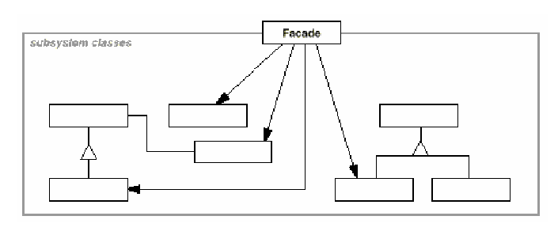
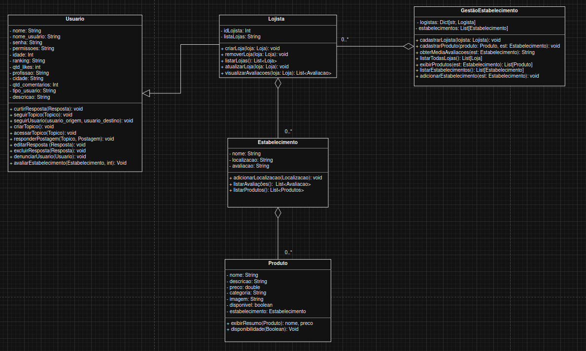

# Façade

## Introdução

Segundo Gamma et al.(1994)[¹](#referência-bibliográfica), os padrões de projeto estruturais preocupam-se em como classes e objetos são combinados de forma a compor estruturas maiores. Nesse sentido, o padrão Façade mostra como representar um subsistema inteiro promovido por uma única interface. 

## Objetivo

Tomar vantagem dos padrões de projeto estruturais e seus benefícios, em especial o Façade, para alcançar uma melhor qualidade de modelagem do sistema.

## Metodologia

O diagrama de classes sintetizado na fase anterior do projeto foi analisado para se enxergar oportunidades de melhoria com a aplicação do façade de acordo com a aplicabilidade definida por Gamma et al.(1994)[¹](#referência-bibliográfica):

- Quando se quer disponibilizar uma interface simples a um substema complexo, provendo uma visão simples o suficiente para a maioria de seus clientes, mas que ainda permita a customização para clientes que realmente precisão;
- quando há diversas dependências entre clientes e as implementações das classe;
- quando se quer dividir o sistema em camadas, definindo um ponto de entrada para cada nível de subsistema.

A seção identificada como interessante para a aplicação do Façade compreende as classes `Usuario, Lojista, Estabelecimento e Produto`. Nessa seção encontram-se classes altamente acopladas que são utilizadas por classes cliente como `Lojista` e `Usuario`, que necessitam interagir diretamente com as todas classes do subsistema. Não se viu a necessidade, por exemplo, do uso do Mediator, outro padrão de projeto estrutural que abstrai funcionalidades de um conjuto de classes. Isso porque a completa centralização entre as classes do subsitema traria complexidade indesejada. A partir dessa decisão foi aplicado o padrão de projeto como estruturado por Gamma et al.(1994)[¹](#referência-bibliográfica) como mostra a figura 1:

<b>Figura 1:</b>  Estrutura do Façade

    

<b>Autor:</b>  Gamma et al., 1994

- **Façade:** tem conhecimento das classes do subsistema responsáveis por um requerimento e delegam os pedidos dos clientes aos componentes apropriados do subsistema.
- **Classes do subsistema:** implementam a funcionalidade do subsistema e fazem o trabalho delegado a elas pela façade.

## Modelagem

A figura 2 a seguir corresponde à modelagem de aplicação do padrão de projeto Façade

<b>Figura 2:</b>  Diagrama do Façade

    

<b>Autor(es):</b>  [João Vitor](https://github.com/Joa0V) e [Gustavo Alves](https://github.com/gustaallves) , 2025

- **GestaoEstabelecimento:** façade 
- **Lojista, Estabelecimento, Produto:** classes do subsistema

Dessa forma conseguimos desacoplar os clientes do subsistema ao introduzir uma interface que isola da complexidade do subsistema ao mesmo tempo que deixa sua comunicação mais amigável aos clientes. Ainda assim, o uso das classes do subsistema não é impedida, permitindo um uso personalizado dessas classes por clientes que necessitam de especificidade.

## Código

A seguir, código de implementação do padrão de projeto Façade.

## Conclusão

## Referência Bibliográfica

>  1. GAMMA, E. *et al.* Design Patterns. [s.l.] Pearson Education, 1994.

## Bibliografia

## Histórico de Versionamento

| Versão | Data       | Alteração              | Responsável     | Revisor           | Data de revisão |
| :-: | :-: | :-: | :-: | :-: |
| `1.0` | 02/06/2025  | Versão inicial do artefato. | [João Vitor](https://github.com/Joa0V) | - | - |
