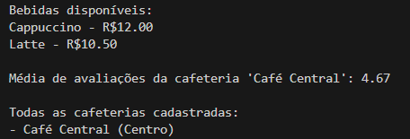

# Facade

## Introdução

Segundo Gamma et al.(1994)[¹](#referência-bibliográfica), os padrões de projeto estruturais preocupam-se em como classes e objetos são combinados de forma a compor estruturas maiores. Nesse sentido, o padrão Facade mostra como representar um subsistema inteiro promovido por uma única interface. 

## Objetivo

Tomar vantagem dos padrões de projeto estruturais e seus benefícios, em especial o Facade, para alcançar uma melhor qualidade de modelagem do sistema.

## Metodologia

O diagrama de classes sintetizado na fase anterior do projeto foi analisado para se enxergar oportunidades de melhoria com a aplicação do facade de acordo com a aplicabilidade definida por Gamma et al.(1994)[¹](#referência-bibliográfica):

- Quando se quer disponibilizar uma interface simples a um substema complexo, provendo uma visão simples o suficiente para a maioria de seus clientes, mas que ainda permita a customização para clientes que realmente precisão;
- quando há diversas dependências entre clientes e as implementações das classe;
- quando se quer dividir o sistema em camadas, definindo um ponto de entrada para cada nível de subsistema.

A seção identificada como interessante para a aplicação do Facade compreende as classes `Usuario, Lojista, Estabelecimento e Produto`. Nessa seção encontram-se classes altamente acopladas que são utilizadas por classes cliente como `Lojista` e `Usuario`, que necessitam interagir diretamente com as todas classes do subsistema. Não se viu a necessidade, por exemplo, do uso do Mediator, outro padrão de projeto estrutural que abstrai funcionalidades de um conjuto de classes. Isso porque a completa centralização entre as classes do subsitema traria complexidade indesejada. A partir dessa decisão foi aplicado o padrão de projeto como estruturado por Gamma et al.(1994)[¹](#referência-bibliográfica) como mostra a figura 1:

<center>
<font size="3"><p style="text-align: center"><b>Figura 1:</b>  Estrutura do Facade</p></font>

<div style="text-align: center;">
    
</div>

<font size="3"><p style="text-align: center"><b>Autor:</b>  Gamma et al., 1994</p></font>
</center>

- **Facade:** tem conhecimento das classes do subsistema responsáveis por um requerimento e delegam os pedidos dos clientes aos componentes apropriados do subsistema.
- **Classes do subsistema:** implementam a funcionalidade do subsistema e fazem o trabalho delegado a elas pela facade.

## Modelagem

A figura 2 a seguir corresponde à modelagem de aplicação do padrão de projeto Facade

<center>
<font size="3"><p style="text-align: center"><b>Figura 2:</b>  Diagrama do Facade</p></font>

<div style="text-align: center;">
    
</div>

<font size="3"><p style="text-align: center"><b>Autor(es):</b>  [João Vitor](https://github.com/Joa0V) e [Gustavo Alves](https://github.com/gustaallves) , 2025</p></font>
</center>

- **GestaoEstabelecimento:** facade 
- **Lojista, Estabelecimento, Produto:** classes do subsistema

Dessa forma conseguimos desacoplar os clientes do subsistema ao introduzir uma interface que isola da complexidade do subsistema ao mesmo tempo que deixa sua comunicação mais amigável aos clientes. Ainda assim, o uso das classes do subsistema não é impedida, permitindo um uso personalizado dessas classes por clientes que necessitam de especificidade.

## Código

A seguir, código de implementação do padrão de projeto Facade.

``` class Produto:
    def _init_(self, nome, preco, estabelecimento):
        self.nome = nome
        self.preco = preco
        self.estabelecimento = estabelecimento
        self.disponivel = True

    def exibir_resumo(self):
        return f"{self.nome} - R${self.preco:.2f}"


class Estabelecimento:
    def _init_(self, nome, localizacao):
        self.nome = nome
        self.localizacao = localizacao
        self.produtos = []
        self.avaliacoes = []

    def adicionar_produto(self, produto):
        self.produtos.append(produto)

    def adicionar_avaliacao(self, nota):
        self.avaliacoes.append(nota)

    def media_avaliacoes(self):
        if not self.avaliacoes:
            return "Sem avaliações"
        media = sum(self.avaliacoes) / len(self.avaliacoes)
        return f"{media:.2f}"


class Lojista:
    def _init_(self, nome):
        self.nome = nome
        self.lojas = []

    def criar_loja(self, loja):
        self.lojas.append(loja)


class GestaoEstabelecimento:
    def _init_(self):
        self.lojistas = {}  
        self.estabelecimentos = []  

    def cadastrarLojista(self, lojista):
        self.lojistas[lojista.nome] = lojista

    def cadastrarProduto(self, produto, est):
        est.adicionar_produto(produto)

    def obterMediaAvaliacoes(self, est):
        return est.media_avaliacoes()

    def listarTodasLojas(self):
        return [loja for lojista in self.lojistas.values() for loja in lojista.lojas]

    def exibirProdutos(self, est):
        return est.produtos

    def listarEstabelecimentos(self):
        return self.estabelecimentos

    def adicionarEstabelecimento(self, est):
        self.estabelecimentos.append(est)


# --- USO / TESTE DO SISTEMA ---

gestao = GestaoEstabelecimento()

# Cadastrando um lojista
lojista = Lojista("João")
gestao.cadastrarLojista(lojista)

# Criando e adicionando uma loja
loja = Estabelecimento("Mercado Central", "Centro")
lojista.criar_loja(loja)
gestao.adicionarEstabelecimento(loja)

# Adicionando produtos à loja
p1 = Produto("Arroz", 20.50, loja)
p2 = Produto("Feijão", 7.30, loja)
gestao.cadastrarProduto(p1, loja)
gestao.cadastrarProduto(p2, loja)

# Adicionando avaliações
loja.adicionar_avaliacao(4)
loja.adicionar_avaliacao(5)
loja.adicionar_avaliacao(3)

# Exibindo produtos
print("Produtos disponíveis:")
for produto in gestao.exibirProdutos(loja):
    print(produto.exibir_resumo())

# Mostrando média de avaliações
print(f"\nMédia de avaliações da loja '{loja.nome}': {gestao.obterMediaAvaliacoes(loja)}")

# Listando todas as lojas
print("\nTodas as lojas cadastradas:")
for l in gestao.listarTodasLojas():
    print(f"- {l.nome} ({l.localizacao})") 
```

## Teste de Logs e Print Final

A figura 3 a seguir mostra o resultado no terminal com a aplicação

<center>
<font size="3"><p style="text-align: center"><b>Figura 3:</b>  Print Facade</p></font>

<div style="text-align: center;">
    
</div>

<font size="3"><p style="text-align: center"><b>Autor(es):</b>  [João Vitor](https://github.com/Joa0V) e [Gustavo Alves](https://github.com/gustaallves) , 2025</p></font>
</center>


## Conclusão

A aplicação do padrão de projeto Facade mostrou-se eficaz na simplificação da interação entre classes clientes e um subsistema complexo. Ao introduzir uma interface unificada por meio da classe GestaoEstabelecimento, foi possível reduzir o acoplamento, melhorar a legibilidade e facilitar a manutenção do código.


## Bibliografia

>  1. GAMMA, E. *et al.* Design Patterns. [s.l.] Pearson Education, 1994.

> REFACTORING GURU. Padrão Facade. Disponível em: https://refactoring.guru/pt-br/design-patterns/facade. Acesso em: 01/06/2025.

## Histórico de Versionamento

| Versão | Data       | Alteração              | Responsável     | Revisor           | Data de revisão |
|--------|------------|------------------------|------------------|-------------------|------------------|
| `1.0` | 02/06/2025  | Criação do documento e conteúdo. |[João Vitor](https://github.com/Joa0V) |  | |
| `1.1`  | 02/06/2025 | Adição da implementação em Python | [Gustavo Alves](https://github.com/gustaallves) | |   |
