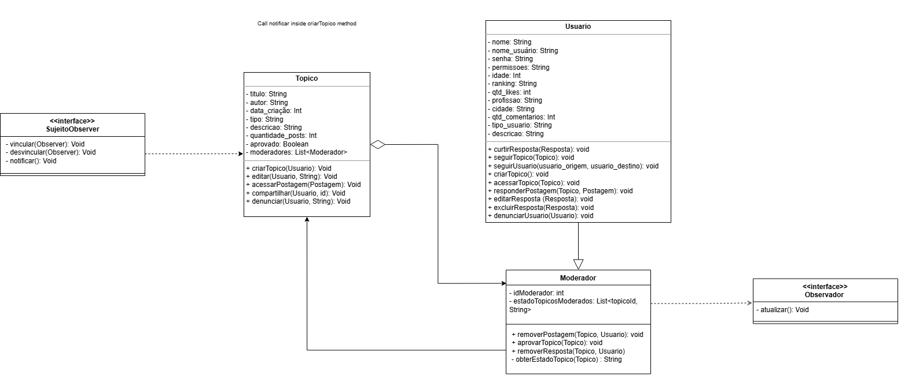

# Observer

## Introdução 

O padrão **Observer** é um padrão de projeto comportamental que define uma dependência um-para-muitos entre objetos, de forma que, quando um objeto muda de estado, todos os seus dependentes (observadores) são automaticamente notificados e atualizados.

No contexto do projeto **Café e Cia**, utilizamos o padrão Observer em dois cenários principais:

1. **Moderação de Tópicos**: quando um usuário cria, edita ou denuncia um tópico, os moderadores registrados são notificados automaticamente para que possam avaliar e tomar as ações necessárias (como aprovar, rejeitar ou revisar o conteúdo).

2. **Notificação de Respostas**: quando uma nova resposta é adicionada a uma postagem, os usuários interessados (seguidores do tópico ou autores da postagem original) recebem uma notificação automática, permitindo o acompanhamento em tempo real das interações.

A adoção do padrão Observer nesses contextos permite manter o sistema desacoplado, reativo e escalável, melhorando a experiência do usuário e a eficiência da moderação e da comunicação entre participantes da comunidade.


## Metodologia

A implementação do padrão Observer no projeto **Café e Cia** foi realizada com base em dois cenários específicos identificados durante a análise de requisitos: **moderação de tópicos** e **notificação de respostas**.

Para isso, seguimos as seguintes etapas metodológicas:

1. **Identificação dos papéis**: definimos os papéis de *Sujeito (Subject)* e *Observador (Observer)* em cada contexto. No caso da moderação, o *Tópico* atua como sujeito e os *Moderadores* como observadores. Na notificação de respostas, o *Postagem* é o sujeito, e os *Usuários* interessados são os observadores.

2. **Modelagem orientada a objetos**: utilizamos diagramas de classes para representar as relações entre os objetos envolvidos, destacando os métodos principais como `attach()`, `detach()` e `notify()`.

3. **Separação de responsabilidades**: aplicamos o princípio de responsabilidade única, mantendo a lógica de notificação isolada em classes específicas, como `Moderador` e `Usuario`, que reagem às mudanças no estado dos objetos observados.

4. **Facilidade de extensão**: garantimos que novos tipos de notificações ou regras de moderação possam ser adicionados sem afetar o funcionamento atual do sistema, promovendo o reuso de código e a manutenção facilitada.

Essa abordagem permitiu implementar um sistema reativo, onde os objetos são atualizados automaticamente conforme eventos ocorrem, sem necessidade de acoplamento direto entre os componentes.


## Modelagem

Para representar o padrão de projeto **Observer** em nosso sistema, elaboramos diagramas simplificados que ilustram os principais elementos envolvidos. A modelagem contempla dois cenários principais: a notificação dos moderadores ao surgirem novos tópicos e o aviso aos usuários quando uma nova resposta é publicada em uma postagem.

O padrão Observer foi aplicado para garantir que os objetos interessados (observadores) sejam automaticamente atualizados sempre que ocorrerem mudanças relevantes no objeto observado. Essa abordagem proporciona uma arquitetura mais flexível, com baixo acoplamento entre os componentes, facilitando tanto a manutenção quanto a escalabilidade do sistema.

A Figura 1 apresenta o diagrama UML do Observer focado na notificação dos moderadores, enquanto a Figura 2 ilustra o diagrama UML referente à notificação dos usuários sobre novas respostas. Esses diagramas serviram como base para a implementação do código, permitindo uma visualização clara das responsabilidades e interações entre os elementos do sistema.

<center>
<p style="text-align: center"><b>Figura 1:</b> Diagrama UML Observer moderador utilizado no projeto.</p>



<font size="3"><p style="text-align: center"><b>Autor:</b> <a href="">Samuel Ribeiro, Nicollas Gabriel, João Vitor. </a>, 2025</p></font>
</center>

<center>
<p style="text-align: center"><b>Figura 2:</b> Diagrama UML Observer Resposta utilizado no projeto.</p>


<font size="3"><p style="text-align: center"><b>Autor:</b> <a href="">Samuel Ribeiro, Nicollas Gabriel, João Vitor. </a>, 2025</p></font>
</center>


## Código - Notificação de Moderador

```python
from typing import List, Dict

class Observador:
    def atualizar(self):
        pass

class SujeitoObserver:
    def __init__(self):
        self.observers: List[Observador] = []

    def vincular(self, observer: Observador):
        self.observers.append(observer)

    def desvincular(self, observer: Observador):
        self.observers.remove(observer)

    def notificar(self):
        for observer in self.observers:
            observer.atualizar()


# Classes principais
class Usuario:
    def __init__(self, nome, nome_usuario, senha, permissoes, idade, ranking, qtd_likes, profissao, cidade, qtd_comentarios, tipo_usuario, descricao):
        self.nome = nome
        self.nome_usuario = nome_usuario
        self.senha = senha
        self.permissoes = permissoes
        self.idade = idade
        self.ranking = ranking
        self.qtd_likes = qtd_likes
        self.profissao = profissao
        self.cidade = cidade
        self.qtd_comentarios = qtd_comentarios
        self.tipo_usuario = tipo_usuario
        self.descricao = descricao

    def curtirResposta(self, resposta): pass
    def seguirTopico(self, topico): pass
    def seguirUsuario(self, usuario_origem, usuario_destino): pass
    def criarTopico(self): pass
    def acessarTopico(self, topico): pass
    def responderPostagem(self, topico, postagem): pass
    def editarResposta(self, resposta): pass
    def excluirResposta(self, resposta): pass
    def denunciarUsuario(self, usuario): pass


class Moderador(Usuario, Observador):
    def __init__(self, *args, idModerador=None, **kwargs):
        super().__init__(*args, **kwargs)
        self.idModerador = idModerador
        self.estadoTopicosModerados: Dict[str, str] = {}

    def removerPostagem(self, topico, usuario): pass
    def aprovarTopico(self, topico): pass
    def removerResposta(self, topico, usuario): pass
    def obterEstadoTopico(self, topico): return self.estadoTopicosModerados.get(topico.titulo, "Desconhecido")

    def atualizar(self):
        print(f"Moderador {self.nome_usuario} foi notificado de uma alteração.")


class Topico(SujeitoObserver):
    def __init__(self, titulo, autor: str, data_criacao: int, tipo, descricao):
        super().__init__()
        self.titulo = titulo
        self.autor = autor
        self.data_criacao = data_criacao
        self.tipo = tipo
        self.descricao = descricao
        self.quantidade_posts = 0
        self.aprovado = False
        self.moderadores: List[Moderador] = []

    def criarTopico(self, usuario: Usuario):
        print(f"Topico '{self.titulo}' criado por {usuario.nome_usuario}")
        self.notificar()

    def editar(self, usuario: Usuario, string: str):
        self.descricao = string
        print(f"Topico '{self.titulo}' editado por {usuario.nome_usuario}")
        self.notificar()

    def acessarPostagem(self, postagem): pass
    def compartilhar(self, usuario: Usuario, id): pass
    def denunciar(self, usuario: Usuario, motivo: str): pass

```

## Código - Notificação de resposta em Postagem

```python

class Resposta:
    def __init__(self, autor, descricao):
        self.autor = autor
        self.descricao = descricao

    def __repr__(self):
        return f"Resposta({self.autor.nome_usuario}: '{self.descricao}')"


class Usuario:
    def __init__(self, nome, nome_usuario):
        self.nome = nome
        self.nome_usuario = nome_usuario
        self.postagens = []
        self.respostas = []

    def notificar(self):
        print(f"[NOTIFICAÇÃO] {self.nome_usuario}, seu tópico recebeu uma nova resposta!")

    def registrarResposta(self, resposta):
        self.respostas.append(resposta)

    def __repr__(self):
        return f"Usuario({self.nome_usuario})"


class Postagem:
    def __init__(self, autor, data_criacao, descricao):
        self.autor = autor
        self.data_criacao = data_criacao
        self.descricao = descricao
        self.respostas = []

    def gerarResposta(self, usuario, texto):
        resposta = Resposta(usuario, texto)
        self.respostas.append(resposta)
        self.autor.notificar()
        usuario.registrarResposta(resposta)
        return resposta


class Topico(Postagem):
    def __init__(self, titulo, autor, data_criacao, descricao):
        super().__init__(autor, data_criacao, descricao)
        self.titulo = titulo

    def __repr__(self):
        return f"Topico('{self.titulo}', autor={self.autor.nome_usuario})"

```

## Testes

### Notificação de novo Topico


### Notificação de resposta em postagem


## Conclusão

A implementação do padrão Observer no projeto Café e Cia demonstrou-se altamente eficaz para gerenciar as notificações e atualizações em tempo real do sistema. Por meio deste padrão, conseguimos estabelecer um mecanismo robusto de comunicação entre os componentes do sistema, principalmente em dois aspectos críticos:

1. Na moderação de tópicos, onde os moderadores são automaticamente notificados sobre novos conteúdos que requerem sua atenção, melhorando significativamente a eficiência do processo de moderação.

2. No sistema de respostas, onde os usuários são prontamente informados sobre novas interações em seus tópicos, promovendo um engajamento mais dinâmico na plataforma.

O padrão Observer nos permitiu manter um baixo acoplamento entre os componentes, facilitando a manutenção e a extensibilidade do código. Além disso, a implementação demonstrou-se flexível o suficiente para acomodar futuras expansões do sistema, como a adição de novos tipos de notificações ou regras de moderação.

## Bibliografia

GAMMA, E. *et al.* Design Patterns. [s.l.] Pearson Education, 1994.

REFACTORING GURU. Padrão Observer. Disponível em: <https://refactoring.guru/pt-br/design-patterns/proxy>. Acesso em: 30 maio 2025.

## Histórico de Versão

| Versão | Data       | Alteração              | Responsável     | Revisor           | Data de revisão |
|--------|------------|------------------------|------------------|-------------------|------------------|
| `1.0` | 01/06/2025  | Criação do documento e conteúdo. | [Nicollas Gabriel](https://github.com/Nicollaxs), [Samuel Ribeiro](https://github.com/SamuelRicosta), [João Vitor](https://github.com/Joa0V)  | [Gustavo Alves](https://github.com/gustaallves) | 02/06/2025 |