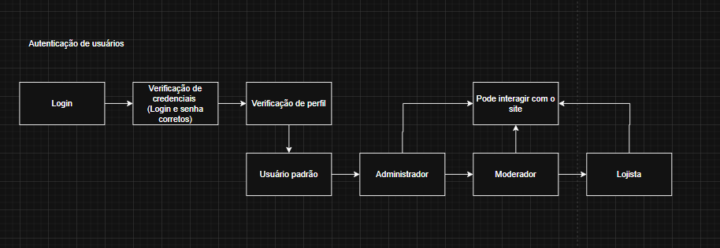

# Chain of Responsability

## Introdução 

### O que é Chain of Responsibility?

O padrão de projeto **Chain of Responsibility** é um padrão comportamental que permite o desacoplamento entre o remetente de uma solicitação e seus possíveis receptores, ao encadear múltiplos objetos (handlers) que podem processar essa solicitação de forma sequencial.

A ideia principal é que cada objeto da cadeia possa lidar com a requisição ou passá-la adiante, sem que o solicitante saiba qual objeto a tratará de fato.

### Analogia com Atendimento ao Cliente

Considere um cenário clássico de atendimento ao cliente:

1. O cliente entra em contato com a **secretária eletrônica**, que tenta resolver com opções automáticas.
2. Se não resolver, o cliente é encaminhado para um **atendente**, que aplica um procedimento padrão.
3. Caso o problema persista, o caso é passado para um **engenheiro**, que resolve de forma especializada.

Cada etapa **tenta resolver o problema**. Se não conseguir, **passa para o próximo nível**. Essa lógica representa perfeitamente o padrão Chain of Responsibility.

### Motivação

Este padrão é ideal para:
- Criar **pipelines de validação** ou tratamento modularizados.
- **Evitar código condicional excessivo** (`if-else`) centralizado.
- Permitir **extensibilidade e reuso** de comportamentos individuais.

## Aplicação no Projeto

Neste projeto, aplicamos o padrão para modelar o **processo de autenticação de usuários**. Cada etapa (login, verificação de credenciais, verificação de perfil, liberação de acesso) é tratada por um handler distinto, formando uma cadeia de responsabilidade.

Cada handler:
- Verifica uma parte do processo.
- Decide se resolve ou repassa para o próximo handler.

## Metodologia

A implementação do padrão Chain of Responsibility no projeto **Sistema de Autenticação Modular** foi realizada com base em um fluxo identificado durante a análise do processo de login: **validação progressiva de credenciais e permissões de acesso**.

Para isso, seguimos as seguintes etapas metodológicas:

1. **Identificação dos handlers**: mapeamos cada etapa da autenticação como um possível ponto de tratamento. Foram definidos quatro handlers principais: `LoginHandler`, `CredentialVerificationHandler`, `ProfileVerificationHandler` e `AccessHandler`, cada um responsável por uma parte específica do processo.

2. **Encadeamento de responsabilidades**: estruturamos os handlers em uma cadeia lógica, onde cada elemento tenta validar sua parte da requisição e, caso não consiga, encaminha para o próximo. Essa abordagem permite tratar os dados de forma sequencial e modular.

3. **Modelagem orientada a objetos**: utilizamos herança para definir uma interface comum `Handler`, garantindo que todos os manipuladores compartilhem os métodos `set_next()` e `handle()`. Isso facilita a criação e substituição de etapas no fluxo.

4. **Separação de responsabilidades**: aplicamos o princípio de responsabilidade única, mantendo a lógica de cada verificação (ex: login, credencial, perfil) isolada em seus respectivos handlers, promovendo clareza, testabilidade e facilidade de manutenção.

5. **Facilidade de extensão**: a estrutura permite adicionar novos passos ao processo de autenticação (como verificação de token ou autenticação multifator) sem alterar o código existente, apenas inserindo novos handlers na cadeia.

Essa abordagem resultou em um fluxo de autenticação limpo, desacoplado e altamente extensível, no qual cada componente é responsável por uma única tarefa e pode ser reutilizado em outros contextos do sistema.

## Modelagem

Para representar o padrão de projeto **Chain of Responsibility** no sistema de autenticação, elaboramos um diagrama de fluxo que ilustra as etapas sequenciais do processo de validação de usuários. A modelagem reflete a lógica de encaminhamento da requisição, desde a inserção inicial de dados até a verificação do perfil e liberação de acesso ao sistema.

A aplicação do padrão visa garantir que cada etapa da autenticação seja tratada por um handler específico. Caso a etapa atual não consiga resolver completamente a requisição, ela é encaminhada ao próximo handler da cadeia. Esse modelo proporciona uma arquitetura desacoplada, modular e de fácil manutenção.

A Figura 1 apresenta o fluxo de autenticação de usuários:

1. O processo se inicia com o handler de **Login**, responsável por capturar os dados fornecidos.
2. Em seguida, ocorre a **verificação de credenciais**, onde o sistema valida se o login e senha estão corretos.
3. Após a autenticação básica, o handler de **verificação de perfil** determina o tipo de usuário.
4. Dependendo do perfil identificado (usuário padrão, administrador, moderador ou lojista), o fluxo é encaminhado até o handler responsável por **liberar a interação com o sistema**.

Cada tipo de perfil é validado de forma independente, seguindo o princípio de responsabilidade única. A modelagem orientou a implementação dos handlers, permitindo uma clara separação de responsabilidades e facilitando a adição de novos perfis ou validações no futuro.


<center>
<p style="text-align: center"><b>Figura 1:</b> Diagrama UML Chain Of Responsability para autenticação de usuários utilizado no projeto.</p>



<font size="3"><p style="text-align: center"><b>Autores:</b> <a href="">Filipe Carvalho e Geovane Freitas </a>, 2025</p></font>
</center>

## Código 

### Access Handler

```python
from validators.interface.handler_interface import Handler

class AccessHandler(Handler):
    def handle(self, request):
        perfil = request["perfil"]
        print(f"[Acesso] {perfil.capitalize()} pode interagir com o site")
```

### Credential Handler

```python
from validators.interface.handler_interface import Handler, usuarios

class CredentialVerificationHandler(Handler):
    def handle(self, request):
        print("[Verificação] Checando credenciais...")
        user = usuarios.get(request["username"])
        if user and user["senha"] == request["senha"]:
            request["perfil"] = user["perfil"]
            return self._next.handle(request) if self._next else None
        print("[Erro] Login ou senha incorretos.")
        return None
```

### Handler Interface

```python
from abc import ABC, abstractmethod

usuarios = {
    "joao": {"senha": "1234", "perfil": "usuario"},
    "ana": {"senha": "admin", "perfil": "administrador"},
    "lucas": {"senha": "mod123", "perfil": "moderador"},
    "carla": {"senha": "lojista123", "perfil": "lojista"},
}

class Handler(ABC):
    def __init__(self):
        self.next = None
    
    def set_next(self, next_handler):
        self._next = next_handler
        return next_handler
    
    @abstractmethod
    def handle(self, request):
        pass
```

### Login Handler

```python
from validators.interface.handler_interface import Handler

class LoginHandler(Handler):
    def handle(self, request):
        print("[Login] Capturando dados...")
        if 'username' in request and 'senha' in request:
            return self._next.handle(request) if self._next else None
        print("[Erro] Dados de login ausentes")
```

### Profile Handler

```python
from validators.interface.handler_interface import Handler

class ProfileVerificationHandler(Handler):
    def handle(self, request):
        perfil = request.get("perfil")
        print(f"[Perfil] Perfil identificado: {perfil}")
        if perfil:
            return self._next.handle(request) if self._next else None
        print("[Erro] Perfil não encontrado.")
        return None
```

### Main

```python
from validators.interface.login_handler import LoginHandler
from validators.interface.credential_handler import CredentialVerificationHandler
from validators.interface.profile_handler import ProfileVerificationHandler
from validators.interface.access_handler import AccessHandler

def construir_cadeia_autenticacao():
    login = LoginHandler()
    credenciais = CredentialVerificationHandler()
    perfil = ProfileVerificationHandler()
    acesso = AccessHandler()

    login.set_next(credenciais).set_next(perfil).set_next(acesso)
    return login

if __name__ == "__main__":
    cadeia = construir_cadeia_autenticacao()

    entrada = {
        "username": "harry",
        "senha": "bruxin123"
    }

    cadeia.handle(entrada)
```


## Testes


## Conclusão


A implementação do padrão Chain of Responsibility no projeto Sistema de Autenticação Modular demonstrou-se altamente eficaz para organizar e isolar as etapas do processo de validação de usuários. Por meio deste padrão, foi possível estruturar uma cadeia clara e sequencial de responsabilidades, resultando em um fluxo mais limpo, flexível e de fácil manutenção.

1. No processo de autenticação, cada etapa — desde a captura de dados de login até a liberação de acesso com base no perfil do usuário — foi encapsulada em handlers especializados, garantindo que cada verificação ocorra de forma independente e ordenada.

2. A separação de responsabilidades permitiu maior controle sobre o comportamento de cada etapa, facilitando a identificação de falhas e a inserção de novas regras, como verificação de autenticação multifator ou validação de tokens.

O padrão Chain of Responsibility nos permitiu manter um baixo acoplamento entre os componentes do sistema, promovendo a extensibilidade e reutilização do código. Além disso, a estrutura adotada demonstrou ser robusta o suficiente para acomodar futuras expansões no processo de autenticação, como novos tipos de perfis ou políticas de acesso diferenciadas.

## Bibliografia

GAMMA, E. *et al.* Design Patterns. [s.l.] Pearson Education, 1994.

REFACTORING GURU. Padrão Observer. Disponível em: <https://refactoring.guru/pt-br/design-patterns/proxy>. Acesso em: 30 maio 2025.

## Histórico de Versão

| Versão | Data       | Alteração              | Responsável     | Revisor           | Data de revisão |
|--------|------------|------------------------|------------------|-------------------|------------------|
| `1.0` | 01/06/2025  | Criação do documento e conteúdo. | [Filipe Carvalho](https://github.com/Filipe-002)  | - | - |
| `2.0` | 02/06/2025 | Adição do código | [Geovane Freitas](https://github.com/GeovaneSFT) | - | - |